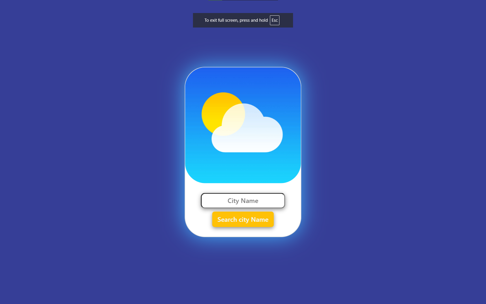

Weather App
A simple and intuitive Weather App that allows users to get real-time weather updates for any city or their current location. The app fetches data from the OpenWeatherMap API and provides key information such as temperature, humidity, wind speed, and more. With its clean and user-friendly design, the app aims to deliver an effortless weather experience.

🌤 Features:
Search for weather by city name or detect weather based on the user's current location.
Displays current temperature, weather condition, humidity, wind speed, and more.
Supports both Celsius and Fahrenheit units.
Responsive design for mobile and desktop users.

🛠 Technologies Used:
Frontend: HTML, CSS, JavaScript
API: OpenWeatherMap API (used to fetch real-time weather data)
Libraries:
Bootstrap (optional, if used) for responsive UI components.

📸 Screenshots:

